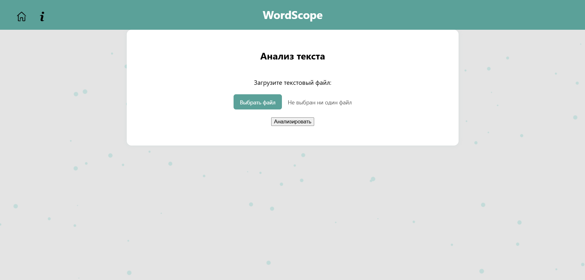
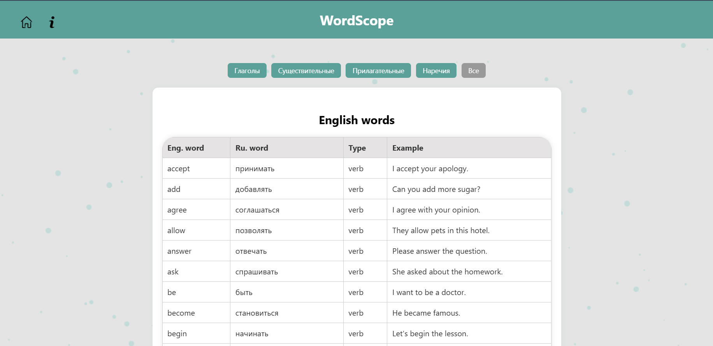

WordScope
📚WordScope — это веб-приложение для анализа английского текста. Пользователь загружает .txt файл, после чего система показывает сколько раз слово входило в txt. Также на сайте есть вкладка "Популярных англ. слов" с фильтром по частям речи.

🚀Возможности
Загрузка текстовых файлов
Частотный анализ слов
Поиск определений и примеров
Фильтрация по частям речи

🛠️Технологии
Django (backend)
HTML, CSS, JavaScript (frontend)
SQLAlchemy и PostgreSQL
AJAX для динамического взаимодействия

Установка
bash
git clone https://github.com/kripersi/WordScope.git
cd WordScope
python -m venv venv
source venv/bin/activate  # Windows: venv\Scripts\activate
pip install -r requirements.txt
python manage.py migrate
python manage.py runserver

Структура проекта
WordScope/ — основной Django-проект
templates/ — HTML-шаблоны
static/ — стили, скрипты, визуальные эффекты
analyzer/ — приложение для обработки текста
popular_words/ — приложение для отображения самых популярных англ. слов
core/ - главная страница(связующая)

🤝 Контакты
Автор: kripersi
Телеграм: @Marpexiz
Gmail: kripersi1123@gmail.com
